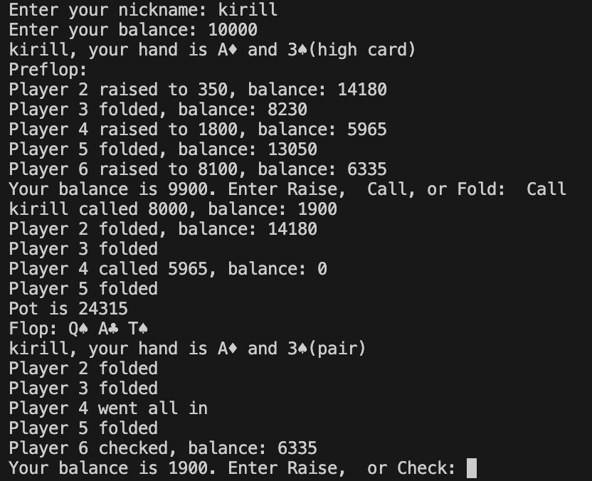

# Coursework
I have attempted to recreate poker card game (Texas Holdem) by writing backend logic  that allows you to play with 5 more players (program-generated bots) with random initial balance. When you run the code in the terminal, the full game is played interactively.  Similar to real life poker, every player receives 2 cards (from shuffled deck), and then betting round begins. When all betting rounds are over, chips are allocated to the winners. Players make desicions on how to act depending on the strengh of their hand. The game continues as long as your balance is positive or you don't want to quit. 

## Below is an example of how game is played 👇

